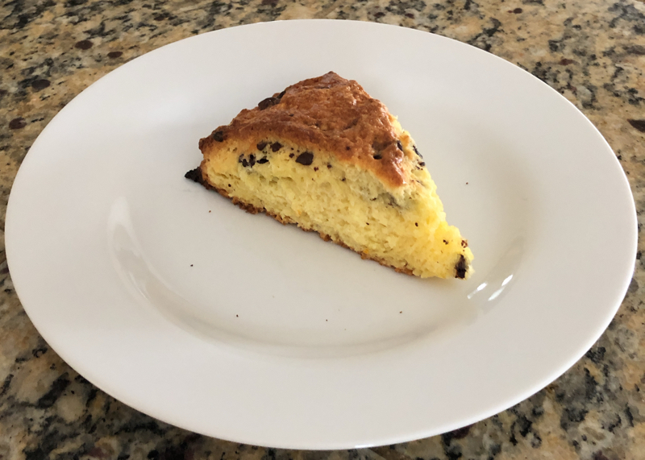

# Orange-Chocolate Scones

## Ingredients

* 2 tsp baking powder
* 2 cups all-purpose flour
* 1/3 cup granulated sugar
* 1/2 tsp salt
* 1/2 cup chilled unsalted butter
* 2 large eggs
* 1/4 cup orange juice
* zest of 1 orange
* 1 tsp vanilla extract
* 3/4 cup dark chocolate chips

For optional glaze, 1 egg white mixed with 1/2 tsp water

# Hardware

* Baking sheet
* Large bowl
* Pastry blender or a pair of knives
* Serrated knife
* Whisk

# Instructions

1. Preheat oven to 425F.
2. Butter a 9-inch diameter circle in the center of a baking sheet
3. In a small bowl, whisk together the eggs, vanilla extract, orange juice and orange zest.
4. In a large bowl, stir together the flour, baking powder, sugar, salt.
5. Cut the butter into half-inch cubes, and distribute them over the top of the flour mixture.
6. With the pastry blender, cut in the butter until the mixture resembles coarse crumbs. If you don't have a pastry blender, you can use two knives, scissors-style.
7. Add egg mixture to the dry ingredients and stir to combine. The dough will be sticky.
8. Lightly flour your hands, knead in the chocolate chips until they are evenly distributed through the dough.
9. Pat the dough into a circle on the buttered circle you prepared on the cooking sheet, then brush the egg-white glaze evenly over the dough circle if you opted for that.
10. Use a serrated knife to pre-cut the dough circle into eight wedges like a pizza. No need to separate the wedges, they'll come apart easily after cooking.
11. Bake for 18-25 minutes until a toothpick in the center comes out clean.
12. Move the scones to a wire rack

Serve warm or let it cool completely before storing in an airtight container.
